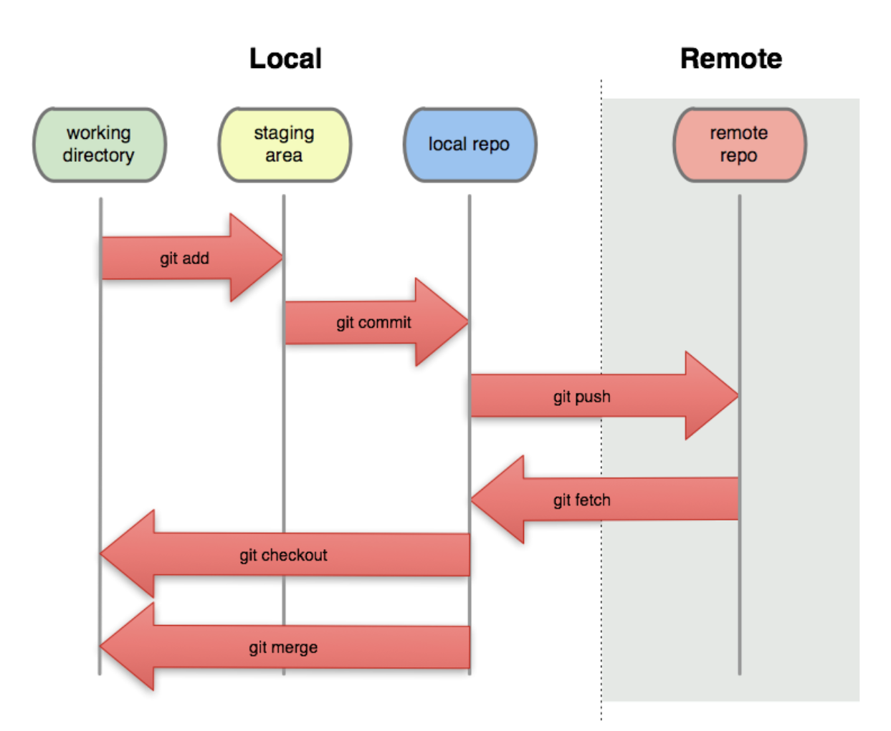

# Clase 02

## .gitignore: Me permite ignorar carpetas y archivos
Esto me permite definir que archivos y carpertas no quiero que formen parte de mi repositorio. Generalmente el  **.gitignore** se coloca en la raiz del proyecto. No necesariamentedebe estar ahi. 

## Repositorio Remoto



> Servicios disponibles para trabajar en la nube

* BitBucket: <https://bitbucket.org/>
* GitLab: <https://about.gitlab.com/>
* GitHub: <https://github.com/>

## Una vez creado el repositorio remoto

1. Asocio la direccion del repositorio de guthub en mi repositorio local
   
> Agregar direccion repo remoto en el local
```sh
git remote add <alias> <url-repo-remoto>
git remote add origin 
```

> Quitar remoto

```sh
git remote remove <alias> <url-repo-remoto>
git remote remove origin 
```

### Para conocer si tengo en el repositorio local la url de remoto

```sh
git remote # info resumida de los remotos asociados
git remote -v # -v:verbose | info detallada de los remotos asociados 
```

2. Subir el local al remoto
   
```sh 
git push -u <remoto> <rama-local> | # u:set-upstream -> vincula la rama local con la rama remota que se crea al subirlo 
```